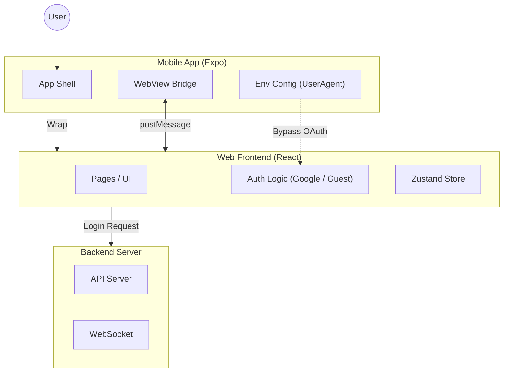

# 🏋️‍♀️ 기다려짐 (Wait Gym) - Hybrid App

> **헬스장 기구 대기 관리 & 운동 루틴 하이브리드 플랫폼**
>
> "기구 앞에서 눈치 보지 말고, 스마트하게 운동하세요."


## 🏗️ System Architecture

모바일 앱 쉘(Native)과 비즈니스 로직(Web)을 분리하여 유지보수성을 높인 **하이브리드 아키텍처**
인증(Auth)을 포함한 주요 로직은 Web에서 수행되며, Native는 환경 설정과 하드웨어 제어를 담당



## 📁 Repository Structure

```bash
├── mobile/       # 📱 Expo (React Native) - 네이티브 쉘 & WebView 환경 설정
└── web/          # 🌐 React (Vite) - 구글/게스트 로그인 및 핵심 서비스 로직
```

## 🚀 Quick Start

각 폴더의 README에서 상세 실행 방법을 확인하세요.

- **Web 실행**: [./web/README.md](./web/README.md) 참고
- **Mobile 실행**: [./mobile/README.md](./mobile/README.md) 참고

## 🤝 Collaboration & Convention

협업과 코드 일관성을 위해 다음과 같은 규칙을 준수했습니다.

### Git Flow & Branch Strategy

- **main**: 배포 가능한 프로덕션 코드
- **dev**: 개발 단계의 코드 통합 브랜치
